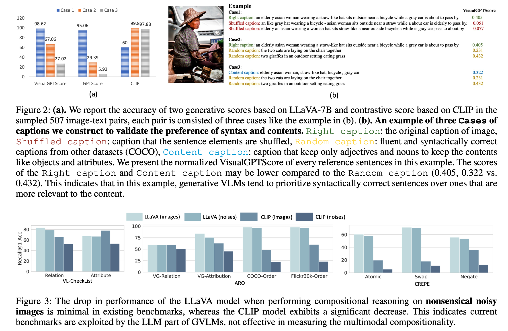

<div align="center">
<h3> An Examination of the Compositionality of Large Generative Vision-Language Models </h3>

[Teli Ma](https://teleema.github.io/)<sup>1</sup>, [Rong Li](https://rongli.tech/)<sup>1</sup>, [Junwei Liang](https://junweiliang.me/index.html)<sup>1, 2</sup>

<sup>1</sup> [AI Thrust, HKUST(GZ)](https://www.hkust-gz.edu.cn/academics/hubs-and-thrust-areas/information-hub/artificial-intelligence/), <sup>2</sup> [CSE, HKUST](https://cse.hkust.edu.hk/)

[[paper](https://arxiv.org/pdf/2308.10509.pdf)] [homepage (coming soon)]

</div>

## Abstract
With the success of Large Language Models (LLMs), a surge of Generative Vision-Language Models (GVLMs) have been constructed via multimodal instruction tuning. The tuning recipe substantially deviates from the common contrastive vision-language learning. However, the performance of GVLMs in multimodal compositional reasoning remains largely unexplored, as existing evaluation metrics and benchmarks focus predominantly on assessing contrastive models like CLIP. In this paper, we examine the potential evaluation metrics to assess the GVLMs and hypothesize generative score methods are suitable for evaluating compositionality. In addition, current benchmarks tend to prioritize syntactic correctness over semantics. The presence of morphological bias in these benchmarks can be exploited by GVLMs, leading to ineffective evaluations. To combat this, we define a MorphoBias Score to quantify the morphological bias and propose a novel LLM-based strategy to calibrate the bias. Moreover, a challenging task is added to evaluate the robustness of GVLMs against inherent inclination toward syntactic correctness. We include the calibrated dataset and the task into a new benchmark, namely MOrphologicall De-biased Benchmark (MODE). Our study provides the first unbiased benchmark for the compositionality of GVLMs, facilitating future research in this direction. We will release our code and datasets.

## Introduction
* Provide an elaborated analysis of potential evaluation protocols for measuring image-text coherence when generative vision-language models perform compositional reasoning.


* We uncover that generative VLMs sometimes prefer syntactical correctness rather than content-related correctness.


* We identify the existence of morphological bias in current multimodal compositional reasoning benchmarks, and we quantitatively assess the bias with a defined MorphoBias Score.
<div  align="center">  
 
</div>

* Based on the MorphoBias Score, we propose a MOrphologicall De-biased Benchmark (MODE) based on current benchmarks for more robust multimodal compositionality evaluation.


## Getting Started 
Code coming soon.

## License
MODE is released under the [MIT License](https://github.com/TeleeMa/MODE/blob/main/LICENSE).

## Citation
```bash
@article{ma2023examination,
  title={An Examination of the Compositionality of Large Generative Vision-Language Models},
  author={Ma, Teli and Li, Rong and Liang, Junwei},
  journal={arXiv preprint arXiv:2308.10509},
  year={2023}
}
```
